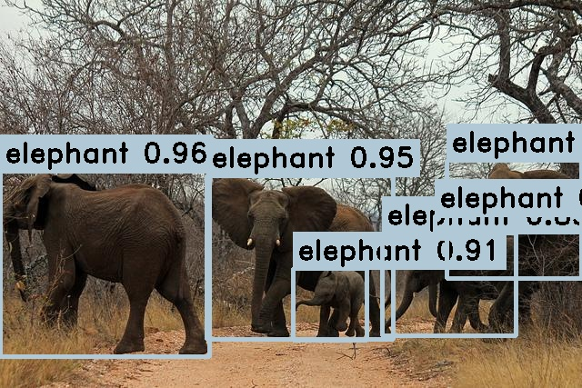

<h1 align="center"><span>YOLOv9-Openvino</span></h1>

C++ and python implementation of [YOLOv9](https://github.com/WongKinYiu/yolov9) using Openvino Backend.

<p align="center" margin: 0 auto;>
  
</p>

## Model

1. Download converted model: [yolov9-c-converted](https://drive.google.com/file/d/1eBs2zlPmPoa-K2N4enTG3srXmesKQyM9/view?usp=sharing)
2. Convert your model:
``` shell
ovc yolov9-c-converted.onnx --compress_to_fp16 True --input images[1,3,640,640]
```
Note that this repository is only for model inference using openvino. Therefore, it assumes the YOLOv9 model is already trained and exported to openvino (.bin, .xml) format. `ocv` can be installed using `pip` command below.

## Setup

**Python:**
``` shell
pip install openvino
```

**CPP:**

Follow this installation guide: [guide](https://docs.openvino.ai/2023.3/openvino_docs_install_guides_installing_openvino_from_archive_windows.html)

## Usage:

**CPP:**
``` shell
yolov9-openvino-cpp.exe <xml model path> <data> <confidence threshold> <nms threshold>

# infer an image
yolov9-openvino-cpp.exe yolov9-c.engine test.jpg 
# infer a folder(images)
yolov9-openvino-cpp.exe yolov9-c.engine data
# infer a video
yolov9-openvino-cpp.exe yolov9-c.engine test.mp4 # the video path
```

**Python:**

``` shell
cd python

# infer an image
python main.py --model=yolov9-c-converted.xml --data_path=test.jpg
# infer a folder(images)
python main.py --model=yolov9-c-converted.xml --data_path=data
# infer a video
python main.py --model=yolov9-c-converted.xml --data_path=test.mp4
```

### Requirement
- 2023.3.0 openvino API
- OpenCV

  ## Acknowledgement
  Based on https://github.com/dacquaviva/yolov5-openvino-cpp-python
