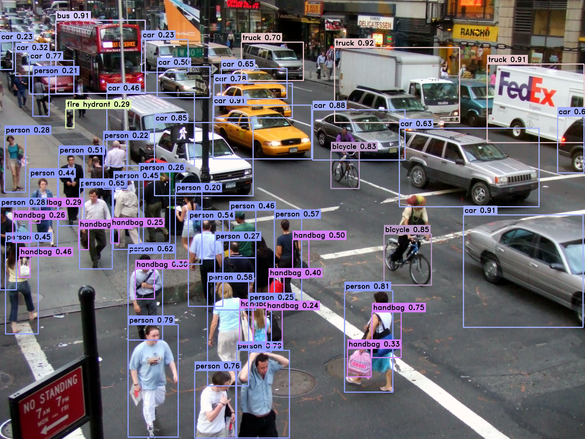

<h1 align="center"><span>YOLOv9-OpenVINO</span></h1>

C++ and python implementation of [YOLOv9](https://github.com/WongKinYiu/yolov9) using Openvino Backend.

<p align="center" margin: 0 auto;>
  
</p>

## 🤖 Model

- Download yolov9-c openvino model: [yolov9-c-converted](https://drive.google.com/file/d/1eBs2zlPmPoa-K2N4enTG3srXmesKQyM9/view?usp=sharing)
- Or convert your custom yolov9 model to openvino format:
``` shell
ovc yolov9-c-converted.onnx --compress_to_fp16 True --input images[1,3,640,640]
```
`ovc` is a command-line model converter that converts trained models in onnx or pytorch format to an OpenVINO model in bin, xml format.


## ⚙️ Build

#### Python

The following command will install openvino python with the `ovc` api:

``` shell
cd python
pip install -r requirement.txt
```

#### C++

1. Download [openvino](https://storage.openvinotoolkit.org/repositories/openvino/packages/2023.3/windows/) and install it following [this guide](https://docs.openvino.ai/2023.3/openvino_docs_install_guides_installing_openvino_from_archive_windows.html)
2. Modify your openvino and opencv paths in [CMakeLists.txt](https://github.com/spacewalk01/yolov9-openvino/blob/main/cpp/CMakeLists.txt)
3. Run the following command to build the project

``` shell
cd cpp
mkdir build
cd build
cmake ..
make
```

## 🚀 Inference

#### Python

Usage: 
``` shell
python main.py --model=<model path> --data_path=<data path> --score_thr=<score> --nms_thr=<nms>
```

Examples:
``` shell
# infer an image
python main.py --model=yolov9-c-converted.xml --data_path=test.jpg
# infer a folder(images)
python main.py --model=yolov9-c-converted.xml --data_path=data
# infer a video
python main.py --model=yolov9-c-converted.xml --data_path=test.mp4
```

#### C++

Usage: 
``` shell
yolov9-openvino-cpp.exe <xml model path> <data> <confidence threshold> <nms threshold>
```

Examples:
``` shell
# infer an image
yolov9-openvino.exe yolov9-c-converted.xml test.jpg 
# infer a folder(images)
yolov9-openvino.exe yolov9-c-converted.xml data
# infer a video
yolov9-openvino.exe yolov9-c-converted.xml test.mp4 # the video path
```

## 🖥️ Requirement

- OpenVINO™ 2023.3.0
- OpenCV

## 🔗 Acknowledgement
This repo is based on the following projects:
- [yolov5-openvino](https://github.com/dacquaviva/yolov5-openvino-cpp-python) - Example of using ultralytics YOLOv5 with Openvino in C++ and Python
- [YOLOv9](https://github.com/WongKinYiu/yolov9) - Learning What You Want to Learn Using Programmable Gradient Information
